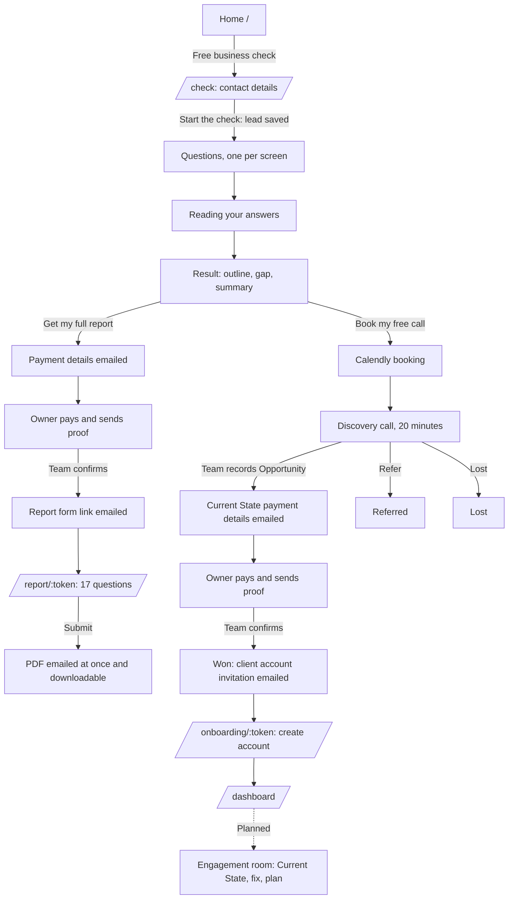
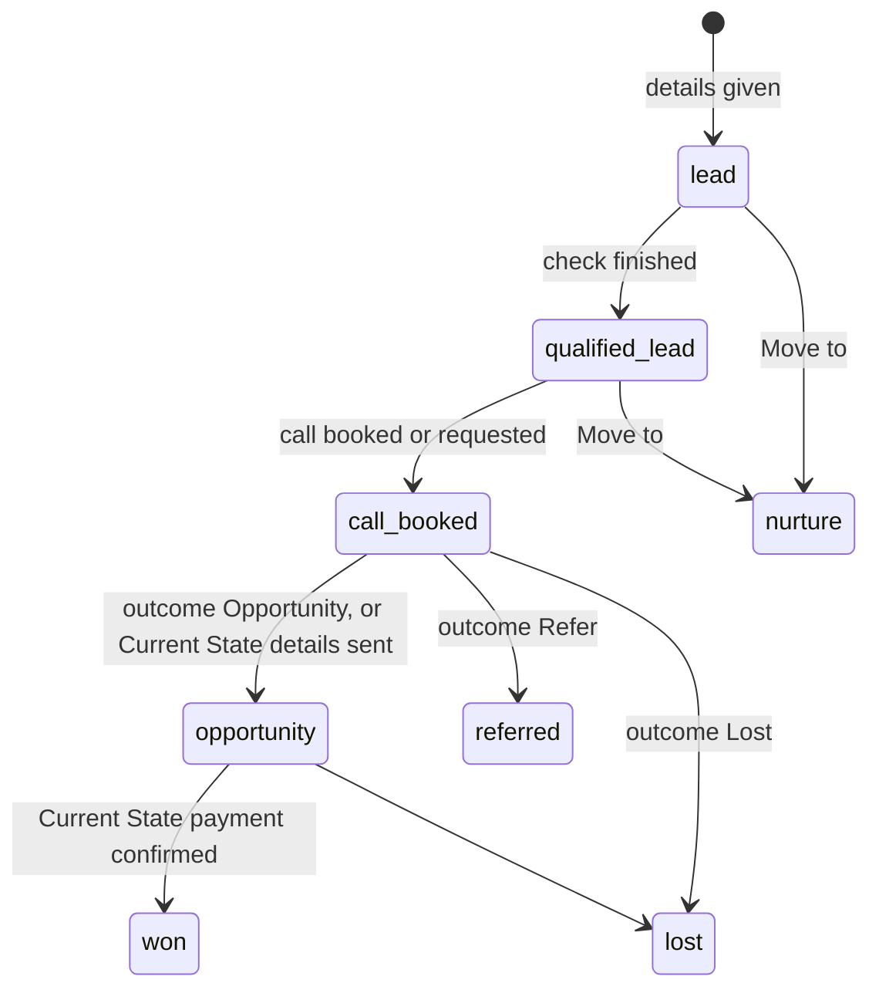
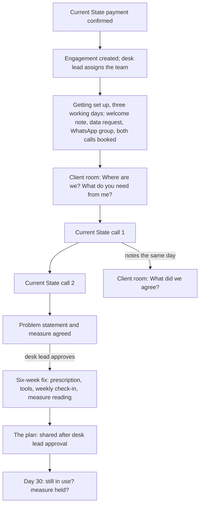

# 3. App flow

**What happens when someone clicks, and which page comes next.** Last reviewed 9 October 2026, against the code on the
working branch. Diagrams use Mermaid, which GitHub renders.

Every route listed in `client/src/App.tsx` appears in section 1. `test/docs/productDocs.test.ts` fails if a route is
added without being documented here.

---

## 1. Page map

### The Shift (current platform)

| Route | Page | Who can reach it | What it does | Next |
|---|---|---|---|---|
| `/` | `Home.tsx` | Anyone | The site in the owner's words: problem, ten problem areas, how it works and prices, questions | "Free business check" → `/check` |
| `/check` | `BusinessCheck.tsx` | Anyone | The free business check, from contact details to the result | Book a call (Calendly) or ask for the full report |
| `/report/:token` | `FullReportPage.tsx` | Link in the "payment received" email | The 17-question report form, then the download | Report emailed; download on the page |
| `/onboarding/:token` | `OnboardingPage.tsx` | Link in the client account invitation | Create the client account | `/dashboard` |
| `/login` | `LoginPage.tsx` | Anyone | Client sign-in with email and password | The landing page (section 6) |
| `/signup` | Redirect | Anyone | No public sign-up | `/login` |
| `/dashboard` | `AccountDashboard.tsx` | Signed-in account | Today: welcome, business profile completion, a link to the internal area for staff. Planned: the engagement room (section 9) | `/settings/business`, `/admin` |
| `/settings/business` | `BusinessSettingsPage.tsx` | Signed-in account (owners and business admins can save) | Business name, description, year founded, sector, website | — |
| `/settings/account` | `AccountSettingsPage.tsx` | Signed-in account | Name and password | — |
| `/admin/login` | `AdminLoginPage.tsx` | Staff | Staff sign-in with email and password | `/admin` |
| `/admin/reset` | `AdminPasswordResetPage.tsx` | Link in a reset email | Reset the administrator password | `/admin/login` |
| `/admin/invite` | `AdminInvitationPage.tsx` | Link in a staff invitation | Accept a staff invitation | `/admin` |
| `/admin` | `Admin.tsx` | Staff with a verified session | The admin console (section 7) | — |
| `/404`, anything else | `NotFound.tsx` | Anyone | Not found | `/` |

### JUMP-era pages still in the code

Kept for history and for JUMP participants. Nothing in The Shift's flow links to them, except the gap noted in section 10.

| Route | Page | What it is |
|---|---|---|
| `/admin/login/legacy` | `AdminLegacyLoginPage.tsx` | Old Google sign-in plus the JUMP administrator password; offered only where Manus OAuth is configured |
| `/portal` | `ParticipantDashboard.tsx` | JUMP participant portal: brief, Current State Assessment, payments with receipts, documents, sessions |
| `/portal/password` | `ParticipantPasswordPage.tsx` | Set a JUMP participant password |
| `/schedule` | `Schedule.tsx` | JUMP session booking (Decide, Learn, Apply) |

The server also redirects `/portal/authenticate` and `/portal/access` to `/?participant_signin=1` (`server/_core/app.ts`).

## 2. The journey, end to end

## 3. The free business check, screen by screen

Source: `client/src/pages/BusinessCheck.tsx`; rules in `shared/businessCheck/engine.ts`.

1. **Intro.** "Take the check". A returning owner sees "Continue where you left off" and "Start again". Progress is kept
   on the device (`localStorage` key `ipf-business-check-v1`) and saved to the server about once a second.
2. **Contact details** ("First, who are we talking to?"): full name, email, WhatsApp (optional, Nigeria by default),
   how they heard. "Start the check" calls `businessCheck.start`, which saves a **Lead**.
3. **Section intros.** Before each section: what it means and an example for the owner's sector.
4. **Questions,** one per screen, with a progress rail and the outline filling in on the side. The path depends on the
   answers (PRD F2). Typed answers (business name, one-line description) are required.
5. **Reading your answers** while `businessCheck.submit` runs. If it fails: "Try again".
6. **Result:** the tally (stuck, watch, clear), "What we found", "What we think it is", the outline with "Start here"
   and the greyed "Not assessed" areas, founder readiness in words, "Where we could help", and **Your next steps**.

On submit, the stage moves to **Qualified lead**; the owner is emailed their summary and the office gets a notice with
every answer.

## 4. From the result to a paid report

| Step | Who | What happens | Email | Stage or status |
|---|---|---|---|---|
| "Get my full report" | Owner | `businessCheck.requestNext({ choice: "report" })` | Owner: *Payment details for your full business check report*; office: *… asked for the full business check report* | Payment: **requested** |
| Proof sent | Owner | Replies to the email with proof | — | — |
| "Proof received" | Finance or Super Admin | `businessSupport.markProofReceived` | — | Payment: **proof received** |
| "Confirm payment" → "Yes, the money is in" | Finance or Super Admin | `businessSupport.confirmPayment`; a report link is issued | Owner: *Payment received: your full business check report* (with the form link) | Payment: **paid**; report: **awaiting form** |
| Form submitted | Owner | `fullReport.submit`; the report is built and rendered at once | Owner: *Your full business check report: {business}* (PDF attached); office: *Full report sent: {business}* | Report: **delivered** |
| "Send the form link again" | Finance or Super Admin | `businessSupport.resendReportLink`; the old link stops working | Owner: *Your report form* | — |
| "Download the report" | Staff with `manage_client_onboarding` | `businessSupport.downloadReport` | — | — |

The form can be submitted once. After that the same link shows "Your report has been sent" with a download button.

**Interim steps:** "Proof received" and "Confirm payment" are manual only because Paystack is not set up yet. With
Paystack, the owner pays online and the payment confirms itself, with the same emails and status changes; manual
confirmation stays for direct transfers. The same applies to the Current State payment in section 5.

## 5. From the call to a client account

| Step | Who | What happens | Email | Stage |
|---|---|---|---|---|
| "Book my free call" | Owner | Calendly opens inline with name and email filled in. The call counts as booked only when Calendly confirms; "open in a new tab" also records the request. With no booking page, the button records a request | Office: *… asked for a free discovery call* (Calendly sends the owner its own confirmation) | **Call booked** |
| "Schedule discovery call" | Desk lead | Records the agreed time | — | — |
| "Record call outcome" | Desk lead | **Opportunity** (fit), **Refer** or **Lost** | — | **Opportunity**, **Referred** or **Lost** |
| "Move to" | Desk lead | Any other stage, with a note (for example **Nurture**) | — | As chosen |
| "Send payment details" (Current State) | Finance or Super Admin | Payment request for ₦500,000 | Owner: *Payment details for your Current State* | Moves to **Opportunity** if earlier |
| "Proof received", then "Confirm payment" | Finance or Super Admin | Payment confirmed; an invitation is created unless one is pending or accepted | Owner: *Payment received: your Current State starts* and *Set up your client account on The Shift* | **Won** |
| "Create account" | Owner | `onboarding.accept`: person, credential, business, owner membership and session in one transaction | — | Invitation: **accepted** |

The desk lead can also send an invitation by hand from **Client Onboarding** ("Invite to onboard") and revoke a pending
one.

## 6. Signing in and where people land

- **Clients** sign in at `/login`. **Staff** sign in at `/admin/login`.
- Landing rule (`landingPathFor`, `shared/auth.ts`): a person with no business membership and at least one platform role
  goes to `/admin`; everyone else goes to `/dashboard`.
- `/dashboard` and the settings pages send a signed-out visitor to `/login`.
- **Invitation link while signed in as someone else:** the page names both email addresses and offers "Sign out and
  continue"; it never sends them to their own area or creates the account under their session. Signed in as the invited
  person: straight to `/dashboard`.
- **Invitation unavailable** (expired, used or revoked): "Invitation unavailable" with a link to `/login`.

## 7. The admin console

`/admin` shows only the tabs a person's permissions allow (`client/src/lib/adminSections.ts`); the server checks every
action again.

| Tab | Permission | What it holds | Actions |
|---|---|---|---|
| **Business Checks** | `manage_client_onboarding` | Metrics (total, completed, call requested, ready to onboard, reports requested); stage filter; search; table with payment chips | Row → detail drawer: contact, the check, findings, outline, recommended support, funnel, **Payments** (send details, proof received, confirm), **Full report** (resend link, download), **Move to** a stage, stage history, next step |
| **Discovery Calls** | `manage_client_onboarding` | Call requests and booked calls | Schedule or reschedule; record outcome (Opportunity, Refer, Lost); "Continue to Client Onboarding" |
| **Client Onboarding** | `manage_client_onboarding` | Metrics (checks, portal users, businesses, memberships, pending links); every check; invitations | "Invite to onboard"; copy the link once; revoke a pending invitation |
| **Clients** | `view_all_businesses` | Onboarded businesses and their members | Read only |
| **Admin Team** | Super Admin | Administrators and invitations | Invite, copy link, revoke, edit powers |
| **JUMP Programme (Legacy)** | `view_participants` | JUMP registrations, referrals, scheduling, replies | JUMP-era actions |

## 8. Status models

- The first three stages move automatically and only forward; they never overwrite a stage the team has set
  (`advancePipeline`, `shared/businessCheck/pipeline.ts`). The team can move a check to any stage with "Move to".
- **Payment request:** requested → proof received → confirmed (`shared/payments.ts`).
- **Full report:** awaiting form → delivered (`full_reports.status`).
- **Client invitation:** pending → accepted, revoked or expired (`client_onboarding_invitations`).

## 9. Planned: the engagement room (not built)

The flow below is the target for phases 1 to 4 of the [implementation plan](06-implementation-plan.md). It is written
here so the build follows an agreed path.

Client view at each step: the current step and date, what is owed (data requests), what was agreed (notes, actions,
measure) and what they have received (deliverables). Team view: the same engagement with internal notes, hours and
the record.

## 10. Known gaps in today's flow

Found while writing this document. Each is small and listed in the implementation plan.

| Gap | Effect | Fix |
|---|---|---|
| Home's "Client sign in" opens the JUMP participant sign-in, not `/login` | A client who returns to the site cannot find their sign-in | Point it at `/login` |
| Staff invitation and password-reset emails still say JUMP and Gmail | Confusing for new staff | Rebrand the two staff emails |
| The `/admin` gate and side menu still say "Registration Desk" and Gmail | Old wording | Rebrand the labels |
| "Invite to onboard" shows on every check, whatever its stage | A lead could be invited before paying | Show it only for Opportunity and Won, or ask to confirm |
| The JUMP "Email selected" button opens nothing | Legacy only | Remove with the JUMP screens |
