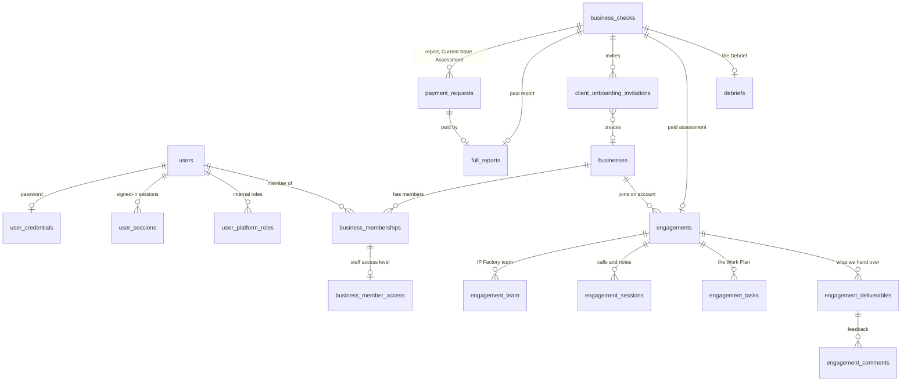

# 5. Backend schema: where client data lives and who can see it

Last reviewed 9 October 2026. The source of truth is `drizzle/schema.ts` (PostgreSQL on Supabase, through Drizzle);
this document explains it. `test/docs/productDocs.test.ts` fails if a table is added to the schema without appearing in
section 2 or 3.

**The model in one line:** a **person** (`users`) has one identity; they can belong to **businesses** through
**memberships** (client side) and hold **platform roles** (IP Factory side). A **business check** is the lead record
that payments, the full report and the client invitation hang off. The **engagement** starts when the Current State
Assessment is paid and joins the client's business when they create their account (section 2, migration 0008).

---

## 1. Conventions

- Every table has `id integer generated by default as identity` as its primary key.
- Timestamps are `timestamp with time zone`; `createdAt` defaults to now, and tables that change carry `updatedAt`.
- Tokens are stored as SHA-256 hashes, never in plain text, with one exception noted in section 6. Passwords use scrypt
  with a salt (`hashAdminPassword`, `server/adminSecurity.ts`).
- Enum values are stable identifiers. Labels shown to people come from shared code (`shared/payments.ts`,
  `shared/businessCheck/pipeline.ts`), so a label can change without a migration.
- Schema changes go through `drizzle/schema.ts` then `pnpm db:generate`; never by hand. Migrations `0000` to `0007` are
  applied to Supabase; `0008` (the engagement room) was applied on 10 October (`docs/database-migrations.md`).

## 2. Tables of The Shift (current platform)

### Identity and access

| Table | What it holds | Keys and rules | Personal or sensitive data |
|---|---|---|---|
| `users` | One identity per person: clients, staff and legacy OAuth users | Unique `openId`; unique `lower(email)`; `status` active, suspended or disabled; legacy `role` user or admin | Name, email, last sign-in |
| `user_credentials` | A person's password | One per user; lockout after five failures for 15 minutes | Password hash |
| `user_sessions` | Server-side sessions behind the `ipf_session` cookie | Unique token hash; expiry; revocation; `activeBusinessId` (the workspace in use) | Token hash |
| `user_platform_roles` | Internal IP Factory roles (super_admin, admin, desk_lead, analyst, partner, subject_matter_expert, finance) | Unique (person, role); who granted it | Who holds which role |
| `admin_permission_profiles` | Extra capabilities chosen by the Super Admin for a person | One per user | — |
| `admin_access_audit_events` | Append-only audit trail for staff, payments, reports, roles and onboarding | Written through `recordAudit` (`server/audit.ts`); details never contain secrets | Actor id, target email |

### Clients

| Table | What it holds | Keys and rules | Personal or sensitive data |
|---|---|---|---|
| `businesses` | A client's workspace | Unique slug; status active, suspended or archived | Name, description, sector, website, staff band, revenue band, location |
| `business_memberships` | Who belongs to which business, as owner, business_admin or member | Unique (business, person); only `active` grants access | Membership |

### The funnel: check, payments, report, invitation

| Table | What it holds | Keys and rules | Personal or sensitive data |
|---|---|---|---|
| `business_checks` | One free business check: contact, answers, result, summary, pipeline stage, call dates | Unique public token; stage from `PIPELINE_STAGES` | Name, email, WhatsApp, how they heard, business name and description, answers (including revenue band and what the problem costs each month) |
| `payment_requests` | A bank-transfer request for the full report or Current State Assessment | Unique reference (`TS-R-000123`, `TS-CS-000123`); one per check and item; status requested, proof received, confirmed. The 48-hour window runs from `requestedAt`, which resets when the details are sent again, so "48 hours passed" is worked out, not stored | Amount, reference, the team's note (bank transaction reference). Proof arrives by email and is not stored |
| `full_reports` | The paid report: link, form answers, delivery | One per check; unique token hash; status awaiting_intake or delivered; `reportVersion` | **Financial figures**: revenue, costs, margin, prices, cash, money owed, loans, competitors |
| `client_onboarding_invitations` | The single-use link that creates a client account | Unique token hash; one pending per check; status pending, accepted, revoked, expired; expiry | Email, name and business name at the time |

The full report PDF is **not stored**: it is rebuilt from the stored form answers whenever it is emailed or downloaded,
so the same answers always give the same document.

### The engagement room (migration 0008)

Additive only: no existing table changes, so sign-in, onboarding and payments work on a database without these tables,
and the room says it is not set up. Vocabulary and the who-sees-what rules: `shared/engagement.ts`; the server side:
`server/engagements.ts`.

| Table | What it holds | Keys and rules | Personal or sensitive data |
|---|---|---|---|
| `engagements` | One per paid client: the business check, the Current State Assessment payment, the business (once the owner has an account), stage, the one problem (area, sub-problem, statement), dates | Unique business check; created by confirming the payment; linked by accepting the invitation, whichever comes second | The problem statement, in the owner's words |
| `engagement_team` | Who from IP Factory works on it: lead, analyst, partner, specialist | Unique (engagement, person); only people with an internal role | Who works for which client |
| `engagement_sessions` | Sessions: kind, title, time, length, link, agenda, status, and their place in the Work Plan (`weekNumber`, `sortOrder`, 0009); the client's version of the notes and the internal notes | Notes reach the client only once shared, with an audience (`owner` by default) | **Session notes**: what the owner said on the call |
| `engagement_tasks` | The Work Plan: Data Requests and actions in one list: whose side, which person, due date, status (to do, sent, received, needs more, done), week and order in the week, and the factor tested (`internal` or `external`, 0009) | A client-side task with no person belongs to the whole business | What the client was asked for |
| `debriefs` | The Debrief (0009): one per business check; held at; what we heard, the problem in the owner's words, what success looks like, what they tried, next steps; who captured it; shared at | Internal until `sharedAt` is set; the room shows it to the owner and full-access staff only, never who captured it | **The owner's own account of their business and problem** |
| `engagement_deliverables` | Findings, problem statement, prescription, tools, plan: status draft, awaiting approval, approved, shared; audience; the owner's sign-off | A prescription or plan cannot be shared before approval (review_engagements); editing a shared one takes it back to draft | **Findings** about the business and its people |
| `engagement_comments` | Feedback on a deliverable, from the client or the team | Only on a deliverable the writer can see | Comments |
| `engagement_files` | Files in private storage: the data request or deliverable they belong to, audience | Unique storage key under `engagements/{id}/tasks|deliverables/{id}/`; uploaded straight to a private Supabase bucket with a one-off signed URL, recorded only once the object exists; opened through five-minute signed links after the same access check (`server/fileStorage.ts`) | **Client files**: bank statements, accounts, staff lists |
| `engagement_measures` | The fix's one number: name, definition, unit, baseline, target | One per engagement (D3) | Business figures |
| `engagement_checkins` | One row per fix week: the five-question check-in, the reading, the questions asked and the hours by role (concept note §17) | Unique (engagement, week); week N is recorded only after week N-1 | The client sees the reading and the next step only; hours, blockers, questions and AI use stay with the team |
| `business_member_access` | The owner's staff: `full` or `contributor` | One per membership; no row means full (owners and business admins never have one) | — |
| `account_invitations` | Invitations that create an account for IP Factory staff (with a role) or the owner's staff (with an access level) | Token stored as a hash; single use, expiring, revocable; one pending per email. Staff: `manage_roles` invites, never Super Admin. Seats: the owner of the business in use, within `TEAM_SEATS_INCLUDED` | Email and name |

## 3. JUMP-era tables (legacy)

Kept so JUMP participants and history still work. The Shift's flow does not read or write them. Retire them only once
nothing reads them (implementation plan, phase 5).

| Area | Tables |
|---|---|
| Legacy staff sign-in (Google OAuth plus an administrator password) | `admin_credentials`, `admin_access_sessions`, `admin_password_reset_tokens`, `admin_invitations` (also read by the new sign-in to reserve invited emails) |
| JUMP applications and programme | `registrations`, `participant_programme_records`, `participant_programme_milestone_events`, `pricing_requests` |
| JUMP participant portal | `participant_auth_tokens`, `participant_credentials`, `participant_password_tokens`, `participant_portal_links` (unused), `participant_briefs`, `participant_engagement_consents`, `participant_assignments`, `participant_payment_receipts` |
| JUMP assessment | `current_status_assessments`, `consulting_chat_messages`, `consulting_reports` |
| JUMP referrals | `participant_referral_profiles`, `participant_referrals` |
| JUMP sessions | `schedule_slots`, `schedule_bookings`, `scheduled_reminder_deliveries` |
| JUMP email | `email_logs` (every row needs a registration), `inbound_email_replies` |

Note: The Shift records email delivery on its own rows (`deliveryStatus` on payments, invitations and reports), not in
`email_logs`.

## 4. Who can see what

### Roles and permissions

The catalogue lives in `shared/platformPermissions.ts` (`PLATFORM_PERMISSIONS`, `PLATFORM_ROLE_PERMISSIONS`). A person's
authority is the union of their roles, any profile the Super Admin set, and the legacy bridges (`resolveAuthority`).

| Role | Permissions today |
|---|---|
| super_admin | Everything |
| admin | Nothing by default (capabilities are granted one by one) |
| desk_lead | view_all_businesses, manage_engagements, assign_engagements, review_engagements, manage_scheduling, manage_communications |
| analyst | view_assigned_businesses, manage_engagements |
| partner | view_assigned_businesses, review_engagements |
| subject_matter_expert | view_assigned_businesses |
| finance | manage_payments, view_financials |

Business membership roles (`shared/businessCapabilities.ts`): an **owner** can view, edit the profile, manage members,
invite and manage billing; a **business_admin** can view, edit and manage members; a **member** can view.

### Access matrix for The Shift's data

✅ allowed · ⚪ own records only · — no access. "Assigned" scope needs engagement assignments (section 5); until then no
procedure grants assigned-only access.

| Data | Prospect (token link) | Client (own business) | Analyst | Partner / SME | Desk lead | Finance | Super Admin |
|---|---|---|---|---|---|---|---|
| Their own business check, while taking it | ⚪ by the check's token | — | — | — | — | — | — |
| All business checks, pipeline, call outcomes | — | — | — (needs `manage_client_onboarding`) | — | ✅ if granted `manage_client_onboarding` | — | ✅ |
| Payment requests: send, proof, confirm | — | — | — | — | — | ✅ `manage_payments` | ✅ |
| Full report form and download | ⚪ by the report token | — | — | — | ✅ download (`manage_client_onboarding`) | ✅ resend link | ✅ |
| Client invitations | ⚪ by the invitation token | — | — | — | ✅ `manage_client_onboarding` | — | ✅ |
| Business profile | — | ⚪ view; owner and business_admin edit | — | — | ✅ `view_all_businesses` (Clients tab) | — | ✅ |
| Roles and permissions | — | — | — | — | — | — | ✅ `manage_roles` |
| Engagement room: the team's side | — | — | Assigned only (`view_assigned_businesses`); works on it (`manage_engagements`) | Assigned only; partners approve (`review_engagements`) | ✅ all; assigns the team, approves prescriptions and plans | — | ✅ |
| Engagement room: the client's side | — | ⚪ owner: everything shared; full staff: what the owner shares with them; contributors: their own requests and actions | — | — | — | — | — |
| Session notes and findings | — | ⚪ owner by default; the owner widens to their staff | ✅ when assigned | ✅ when assigned | ✅ | — | ✅ |

### How client isolation is enforced

`server/accountAuth.ts`:

- `resolveAccountSession` checks the session against the database on every call (hash, not revoked, not expired,
  person active).
- `loadMemberships` returns only active memberships in active businesses; `chooseActiveBusiness` keeps the stored
  workspace only while it is still a membership.
- `requireBusinessMembership` never trusts a business id sent by the browser; an unknown business and someone else's
  business get the same refusal.
- `requireBusinessCapability` adds the membership role check.
- A client's session never becomes a staff identity: the context builds a staff user only for a person with a platform
  role (`server/_core/context.ts`).

## 5. How the engagement room decides access

1. **The team: permission and assignment.** Seeing an engagement needs `view_all_businesses`, or
   `view_assigned_businesses` and a row in `engagement_team`. Changing it also needs `manage_engagements`;
   changing the team needs `assign_engagements`; approving a prescription or plan needs `review_engagements`. An
   engagement outside someone's scope and one that does not exist get the same "not available".
2. **The client: membership and audience.** The room shows the engagement of the business the person is working in;
   no client procedure accepts a business id. Each note, deliverable and file carries an audience: `team` (never
   leaves IP Factory), `owner` (default for notes and findings, because owners speak frankly on our calls) or
   `business` (the owner's staff with full access). Contributors see only the requests and actions given to them.
   Only owner-level people sign off or change an audience.
3. **"Shared" is stored** with who and when, and every share, approval, sign-off and audience change is in the audit
   trail, so "when did the client see this?" has an answer.
4. **Finance** sees payments, not engagements: no finance permission opens the room.

5. **Invitations** (`account_invitations`, `server/accountInvitations.ts`): a staff invitation creates the person with
   one role; a seat invitation creates the person with a membership and an access level, in the owner's business only,
   within the included seat. Accepting is one transaction; an existing account is never merged.

Still to build: the close and the day-30 check, which need an `engagement_closes` table (migration 0009, December).

## 6. Findings to fix

Found while writing this document.

| Finding | Risk | Fix |
|---|---|---|
| `business_checks.publicToken` is stored in plain text and works as a bearer token for that check | Someone with database read access could resume or submit another person's check | Store a hash, as every other token does; migrate existing rows |
| Full report links (`full_reports.tokenHash`) never expire and the report procedures have no rate limit | A forwarded link opens the report indefinitely | Add an expiry after delivery (or limit downloads) and a rate limit like onboarding's |
| The 30 tables from the baseline migration have no foreign keys or indexes beyond primary and unique keys | Slower queries as data grows; orphaned rows possible | Add indexes on `business_checks` (stage, email, createdAt) first |
| ~~No engagement assignment table~~ | Fixed by 0008: `engagement_team`; `view_assigned_businesses` now opens the engagements a person is on | Done (once 0008 is applied) |
| ~~`adminAccess.listTeam` lists only legacy admins~~ | Fixed 9 October: Admin Team now shows a Staff list from `user_platform_roles` above the legacy list | Done |
| `businessSupport.downloadReport` needs `manage_client_onboarding` while `resendReportLink` needs `manage_payments` | Finance can resend but not download | Decide which permission owns the report |
| `shared/auth.ts` and `docs/authentication.md` still say platform roles are "not built" and name a `platform_role_assignments` table | Misleading | Update the comments: the table is `user_platform_roles` |
| ~~File storage used the Manus "Forge" API~~ | The room now uses a private Supabase bucket (10 October); the Manus proxy remains only for the JUMP-era uploads | Done for the room; retire the proxy with the JUMP screens |
