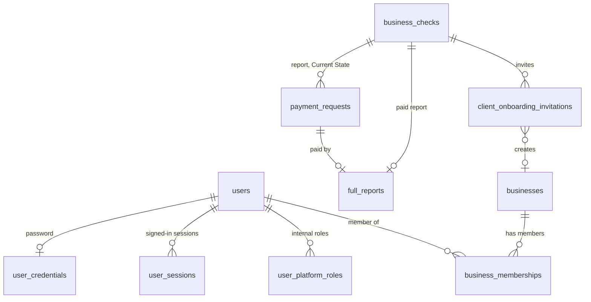

# 5. Backend schema: where client data lives and who can see it

Last reviewed 9 October 2026. The source of truth is `drizzle/schema.ts` (PostgreSQL on Supabase, through Drizzle);
this document explains it. `test/docs/productDocs.test.ts` fails if a table is added to the schema without appearing in
section 2 or 3.

**The model in one line:** a **person** (`users`) has one identity; they can belong to **businesses** through
**memberships** (client side) and hold **platform roles** (IP Factory side). A **business check** is the lead record
that payments, the full report and the client invitation hang off. The **engagement** layer is not built yet
(section 5).

---

## 1. Conventions

- Every table has `id integer generated by default as identity` as its primary key.
- Timestamps are `timestamp with time zone`; `createdAt` defaults to now, and tables that change carry `updatedAt`.
- Tokens are stored as SHA-256 hashes, never in plain text, with one exception noted in section 6. Passwords use scrypt
  with a salt (`hashAdminPassword`, `server/adminSecurity.ts`).
- Enum values are stable identifiers. Labels shown to people come from shared code (`shared/payments.ts`,
  `shared/businessCheck/pipeline.ts`), so a label can change without a migration.
- Schema changes go through `drizzle/schema.ts` then `pnpm db:generate`; never by hand. Migrations `0000` to `0007` are
  applied to Supabase (`docs/database-migrations.md`).

## 2. Tables of The Shift (current platform)

### Identity and access

| Table | What it holds | Keys and rules | Personal or sensitive data |
|---|---|---|---|
| `users` | One identity per person: clients, staff and legacy OAuth users | Unique `openId`; unique `lower(email)`; `status` active, suspended or disabled; legacy `role` user or admin | Name, email, last sign-in |
| `user_credentials` | A person's password | One per user; lockout after five failures for 15 minutes | Password hash |
| `user_sessions` | Server-side sessions behind the `ipf_session` cookie | Unique token hash; expiry; revocation; `activeBusinessId` (the workspace in use) | Token hash |
| `user_platform_roles` | Internal IP Factory roles (super_admin, admin, desk_lead, analyst, partner, subject_matter_expert, finance) | Unique (person, role); who granted it | Who holds which role |
| `admin_permission_profiles` | Extra capabilities chosen by the Super Admin for a person | One per user | — |
| `admin_access_audit_events` | Append-only audit trail for staff, payments, reports, roles and onboarding | Written through `recordAudit` (`server/audit.ts`); details never contain secrets | Actor id, target email |

### Clients

| Table | What it holds | Keys and rules | Personal or sensitive data |
|---|---|---|---|
| `businesses` | A client's workspace | Unique slug; status active, suspended or archived | Name, description, sector, website, staff band, revenue band, location |
| `business_memberships` | Who belongs to which business, as owner, business_admin or member | Unique (business, person); only `active` grants access | Membership |

### The funnel: check, payments, report, invitation

| Table | What it holds | Keys and rules | Personal or sensitive data |
|---|---|---|---|
| `business_checks` | One free business check: contact, answers, result, summary, pipeline stage, call dates | Unique public token; stage from `PIPELINE_STAGES` | Name, email, WhatsApp, how they heard, business name and description, answers (including revenue band) |
| `payment_requests` | A bank-transfer request for the full report or Current State | Unique reference (`TS-R-000123`, `TS-CS-000123`); one per check and item; status requested, proof received, confirmed | Amount, reference, the team's note (bank transaction reference). Proof arrives by email and is not stored |
| `full_reports` | The paid report: link, form answers, delivery | One per check; unique token hash; status awaiting_intake or delivered; `reportVersion` | **Financial figures**: revenue, costs, margin, prices, cash, money owed, loans, competitors |
| `client_onboarding_invitations` | The single-use link that creates a client account | Unique token hash; one pending per check; status pending, accepted, revoked, expired; expiry | Email, name and business name at the time |

The full report PDF is **not stored**: it is rebuilt from the stored form answers whenever it is emailed or downloaded,
so the same answers always give the same document.

## 3. JUMP-era tables (legacy)

Kept so JUMP participants and history still work. The Shift's flow does not read or write them. Retire them only once
nothing reads them (implementation plan, phase 5).

| Area | Tables |
|---|---|
| Legacy staff sign-in (Google OAuth plus an administrator password) | `admin_credentials`, `admin_access_sessions`, `admin_password_reset_tokens`, `admin_invitations` (also read by the new sign-in to reserve invited emails) |
| JUMP applications and programme | `registrations`, `participant_programme_records`, `participant_programme_milestone_events`, `pricing_requests` |
| JUMP participant portal | `participant_auth_tokens`, `participant_credentials`, `participant_password_tokens`, `participant_portal_links` (unused), `participant_briefs`, `participant_engagement_consents`, `participant_assignments`, `participant_payment_receipts` |
| JUMP assessment | `current_status_assessments`, `consulting_chat_messages`, `consulting_reports` |
| JUMP referrals | `participant_referral_profiles`, `participant_referrals` |
| JUMP sessions | `schedule_slots`, `schedule_bookings`, `scheduled_reminder_deliveries` |
| JUMP email | `email_logs` (every row needs a registration), `inbound_email_replies` |

Note: The Shift records email delivery on its own rows (`deliveryStatus` on payments, invitations and reports), not in
`email_logs`.

## 4. Who can see what

### Roles and permissions

The catalogue lives in `shared/platformPermissions.ts` (`PLATFORM_PERMISSIONS`, `PLATFORM_ROLE_PERMISSIONS`). A person's
authority is the union of their roles, any profile the Super Admin set, and the legacy bridges (`resolveAuthority`).

| Role | Permissions today |
|---|---|
| super_admin | Everything |
| admin | Nothing by default (capabilities are granted one by one) |
| desk_lead | view_all_businesses, manage_engagements, assign_engagements, review_engagements, manage_scheduling, manage_communications |
| analyst | view_assigned_businesses, manage_engagements |
| partner | view_assigned_businesses, review_engagements |
| subject_matter_expert | view_assigned_businesses |
| finance | manage_payments, view_financials |

Business membership roles (`shared/businessCapabilities.ts`): an **owner** can view, edit the profile, manage members,
invite and manage billing; a **business_admin** can view, edit and manage members; a **member** can view.

### Access matrix for The Shift's data

✅ allowed · ⚪ own records only · — no access. "Assigned" scope needs engagement assignments (section 5); until then no
procedure grants assigned-only access.

| Data | Prospect (token link) | Client (own business) | Analyst | Partner / SME | Desk lead | Finance | Super Admin |
|---|---|---|---|---|---|---|---|
| Their own business check, while taking it | ⚪ by the check's token | — | — | — | — | — | — |
| All business checks, pipeline, call outcomes | — | — | — (needs `manage_client_onboarding`) | — | ✅ if granted `manage_client_onboarding` | — | ✅ |
| Payment requests: send, proof, confirm | — | — | — | — | — | ✅ `manage_payments` | ✅ |
| Full report form and download | ⚪ by the report token | — | — | — | ✅ download (`manage_client_onboarding`) | ✅ resend link | ✅ |
| Client invitations | ⚪ by the invitation token | — | — | — | ✅ `manage_client_onboarding` | — | ✅ |
| Business profile | — | ⚪ view; owner and business_admin edit | — | — | ✅ `view_all_businesses` (Clients tab) | — | ✅ |
| Roles and permissions | — | — | — | — | — | — | ✅ `manage_roles` |
| Engagement room (planned) | — | ⚪ shared items only | Assigned | Assigned | ✅ | Payments only | ✅ |

### How client isolation is enforced

`server/accountAuth.ts`:

- `resolveAccountSession` checks the session against the database on every call (hash, not revoked, not expired,
  person active).
- `loadMemberships` returns only active memberships in active businesses; `chooseActiveBusiness` keeps the stored
  workspace only while it is still a membership.
- `requireBusinessMembership` never trusts a business id sent by the browser; an unknown business and someone else's
  business get the same refusal.
- `requireBusinessCapability` adds the membership role check.
- A client's session never becomes a staff identity: the context builds a staff user only for a person with a platform
  role (`server/_core/context.ts`).

## 5. Planned: the engagement layer

Not built. The shape below follows the concept note's engagement record (§17) and the PRD (F7, F8). It is the starting
point for phase 1 of the [implementation plan](06-implementation-plan.md); names may change in review.

| Table | Holds | Visible to the client? |
|---|---|---|
| `engagements` | One per paid client: business, the business check it came from, the Current State payment, stage (setting up, Current State, fix, plan, day 30, closed), problem area, sub-problem, problem statement, dates | Stage and dates: yes |
| `engagement_assignments` | Engagement × person × role (lead, analyst, partner, expert) | Names and roles: yes |
| `engagement_sessions` | Calls: type, date, attendees, link | Yes |
| `engagement_notes` | Per session: client version and internal version; status draft or shared; who shared it and when | Client version once shared |
| `engagement_actions` | Who does what by when; status | Yes |
| `engagement_files` | Storage key, name, type, size, uploaded by, the request it answers, shared flag, approval | Shared files only |
| `engagement_data_requests` | The data request list: item, due date, status requested, received, accepted | Yes |
| `engagement_measures` | Measure name, definition, baseline, target | Yes |
| `engagement_checkins` | Weekly row: progress, blockers, next step, measure reading, questions asked, hours by role, AI used | Reading and next step: yes; hours: no |
| `engagement_closes` | Final value, moved, extension weeks, plan delivered, next problem area, ongoing support defined, day-30 check | Summary: yes |

Rules to build in from the start:

1. Every procedure checks both the permission and the assignment (`AGENTS.md`: "Server-side authorisation must check
   both").
2. Files sit in a private bucket; the server hands out short-lived signed links only after the same check.
3. "Shared" is a stored state with who and when, so the audit trail can answer "when did the client see this?".
4. Finance sees payments and invoices for an engagement, not its notes or files.

## 6. Findings to fix

Found while writing this document.

| Finding | Risk | Fix |
|---|---|---|
| `business_checks.publicToken` is stored in plain text and works as a bearer token for that check | Someone with database read access could resume or submit another person's check | Store a hash, as every other token does; migrate existing rows |
| Full report links (`full_reports.tokenHash`) never expire and the report procedures have no rate limit | A forwarded link opens the report indefinitely | Add an expiry after delivery (or limit downloads) and a rate limit like onboarding's |
| The 30 tables from the baseline migration have no foreign keys or indexes beyond primary and unique keys | Slower queries as data grows; orphaned rows possible | Add indexes on `business_checks` (stage, email, createdAt) first |
| No engagement assignment table, so `view_assigned_businesses` grants nothing today | Analysts cannot be given scoped access yet | Phase 1.3 |
| `adminAccess.listTeam` lists only legacy admins; staff who hold only platform roles do not appear | The Admin Team screen undercounts staff | Read `user_platform_roles` there |
| `businessSupport.downloadReport` needs `manage_client_onboarding` while `resendReportLink` needs `manage_payments` | Finance can resend but not download | Decide which permission owns the report |
| `shared/auth.ts` and `docs/authentication.md` still say platform roles are "not built" and name a `platform_role_assignments` table | Misleading | Update the comments: the table is `user_platform_roles` |
| File storage still uses the Manus "Forge" storage API (`server/storage.ts`, `BUILT_IN_FORGE_API_*`) | No file uploads for clients on Vercel without Manus credentials | Phase 1.1: private Supabase Storage bucket |
